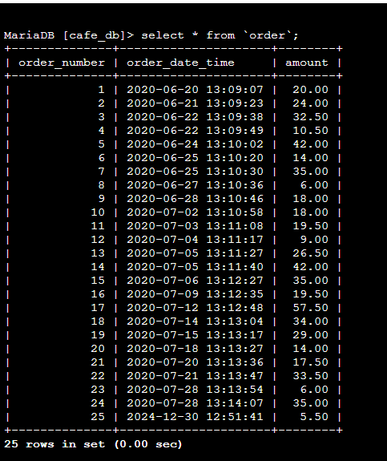

# Challenge Lab: Migrating a Database to Amazon RDS

## Project Overview
This project involves migrating a database from a MariaDB instance hosted on Amazon EC2 to an Amazon Relational Database Service (Amazon RDS) MariaDB instance. Additionally, the project updates a web application to use the new RDS database instance, ensuring improved scalability, durability, and ease of management.


## Features
- **Database Migration:** Transition data from a self-managed EC2 MariaDB instance to a managed RDS instance.
- **Web Application Integration:** Update the application to use the new RDS database instance for data storage.
- **Security Enhancements:** Utilize AWS Secrets Manager for secure database credentials.
- **Cost Optimization:** Recommendations for reducing EC2 resource usage after migration.

## Architecture
After completing the migration, the architecture includes:
- **Amazon RDS** for managing the MariaDB database.
- **Amazon EC2** for hosting the web application.
- Secure connectivity between EC2 and RDS.

## Steps to Reproduce

### 1. Create an RDS Database Instance
1. Go to the [Amazon RDS Console](https://aws.amazon.com/rds/).
2. Create a MariaDB instance with the following settings:


   - **Instance Identifier:** `CafeDatabase`
   - **Username:** `admin`
   - **Password:** Retrieved securely using AWS Secrets Manager.
   - **Instance Class:** `db.t3.micro`
   - **Storage:** 20 GiB General Purpose SSD (gp2)
   - **VPC:** `Lab VPC`
   - **Public Access:** No
3. Ensure the database is in the same VPC as the EC2 instance.

### 2. Export Data from the EC2 Database
1. Connect to the EC2 instance using AWS Systems Manager.

2. Use the `mysqldump` utility to export the database:

   ```bash
   mysqldump --databases cafe_db -u root -p > CafeDbDump.sql
   ```

### 3. Import Data into the RDS Database
1. Connect to the RDS instance:
   ```bash
   mysql -u admin -p --host <rds-endpoint>
   ```
   
2. Import the dumped data:
   ```bash
   mysql -u admin -p --host <rds-endpoint> < CafeDbDump.sql
   ```

### 4. Update Web Application Configuration
1. Update the database connection settings in the web application to point to the RDS instance.
2. Test the application to confirm:
   - Orders are stored in the new database.
   - Previous order history is accessible.



### 5. Optimize EC2 Resources
- Stop the local MariaDB service on the EC2 instance:
  ```bash
  sudo service mariadb stop
  ```


  
  
- Consider resizing the EC2 instance or reducing EBS volume size to save costs.

## Requirements
- **AWS Services:** EC2, RDS (MariaDB), Secrets Manager
- **Database Credentials:** Securely stored in AWS Secrets Manager.
- **Tools:** AWS Management Console, `mysqldump`, MariaDB client.

## Results
- Successfully migrated the database to Amazon RDS.
- Updated the web application to use the new database.
- Improved application reliability and reduced management overhead.

## Future Enhancements
- Reduce EC2 resource usage further.
- Enable automated backups and performance insights for the RDS instance.
- Monitor costs and optimize further where applicable.

---
### Author
This project was implemented as part of an AWS Challenge Lab.

### License
This work is licensed under the terms of [Amazon Web Services](https://aws.amazon.com) usage guidelines.

